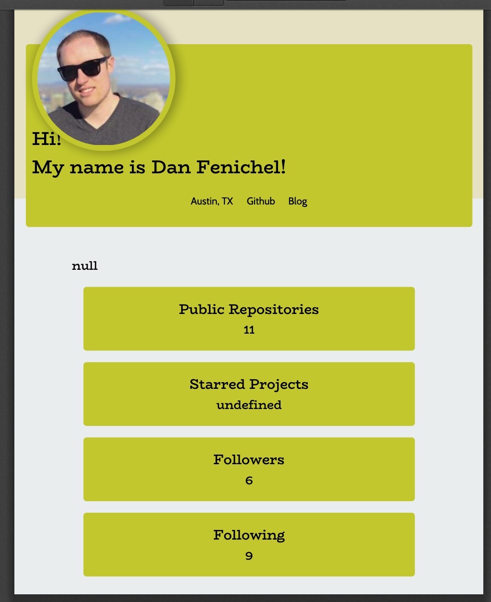

# Dev-Profile-Generator

## User Story

AS A product manager

I WANT a developer profile generator

SO THAT I can easily prepare reports for stakeholders

## Project Description

Created a command-line application that dynamically generates a PDF profile from a GitHub username. The application is invoked with the following command:

```sh
node index.js
```

The user will be prompted for a favorite color, which will be used as the background color for cards.

The PDF will be populated with the following:

* Profile image
* User name
* Links to the following:
  * User location via Google Maps
  * User GitHub profile
  * User blog
* User bio
* Number of public repositories
* Number of followers
* Number of GitHub stars
* Number of users following

## Link to GitHub Repo

https://github.com/danfenichel/dev-profile-generator

## Screenshot of PDF



